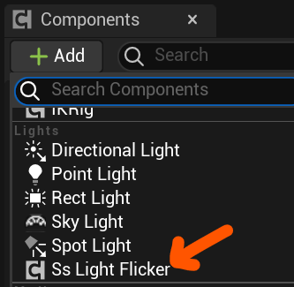
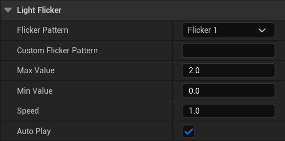
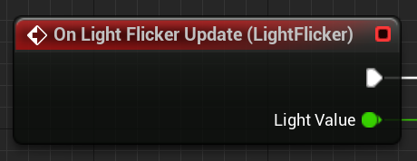

# Light Flicker Component

This component adds the ability to generate a light flicker value, which can be plugged into light intensities, or material parameters, or anything else you want.

It works on the same basis as Quake, Half Life: Alyx and countless other games; there is a "flicker string" made up of lower-case letters a-z, where a = 0, m = 1 and z ~= 2 (actually 2.08 in practice), meaning the default value range is from completely off, to double brightness.

You can use all the [Quake in-built flicker patterns](// https://github.com/id-Software/Quake/blob/bf4ac424ce754894ac8f1dae6a3981954bc9852d/qw-qc/world.qc#L328-L372), or make your own. 

## Adding the component

The flicker component is a non-scene component that can be added to any actor:

## Configure it

### Patterns and Min/Max

If you select "Custom" in the flicker pattern field, you need to supply your own string of a-z characters in "Custom Flicker Pattern". With the default min/max of 0-2 the character values are:

| Char |Value|
|-|--|
|a|0|
|m|1|
|z|2.08|

The max is slightly over 2 as you can see, that's because to make 'm' (char index 12) exactly 1 the divisor has to be 24, meaning 'z' as character 25 is slightly over ('y' is actually 2). 

You can change the output range from the default of 0-2 if you want, just remember that 'z' will slightly exceed the max.

### Speed

By default as with Quake every character in the pattern applies for 0.1s. Change the speed multiplier if you want that to be different.

### AutoPlay

Whether to start playing the flicker immediately, or whether to await a call to `Play()`. 

> When not playing, the component does not tick.

## Using the Output

The component will just output values when it's played on the OnLightFlicker event:

It's up to you to feed these into light intensity values, material parameters etc.